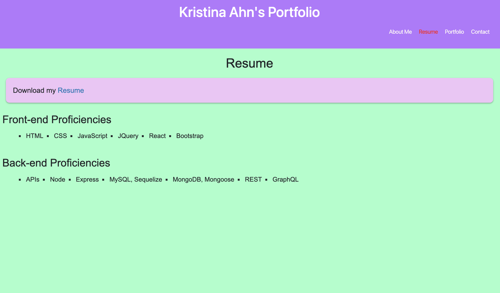
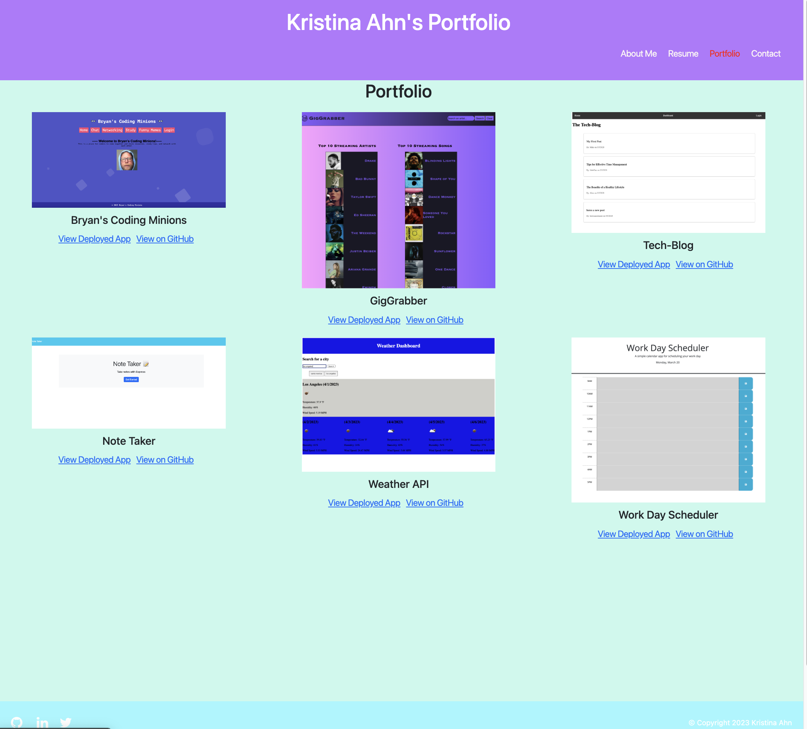
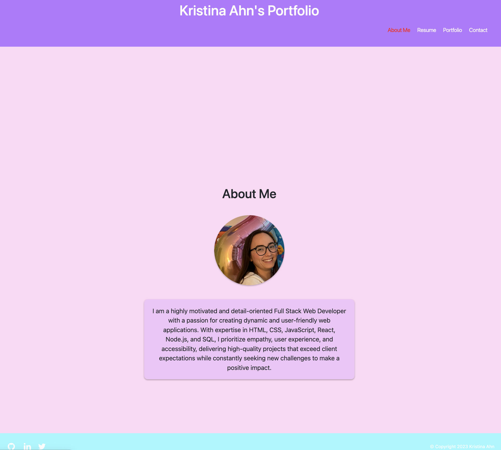
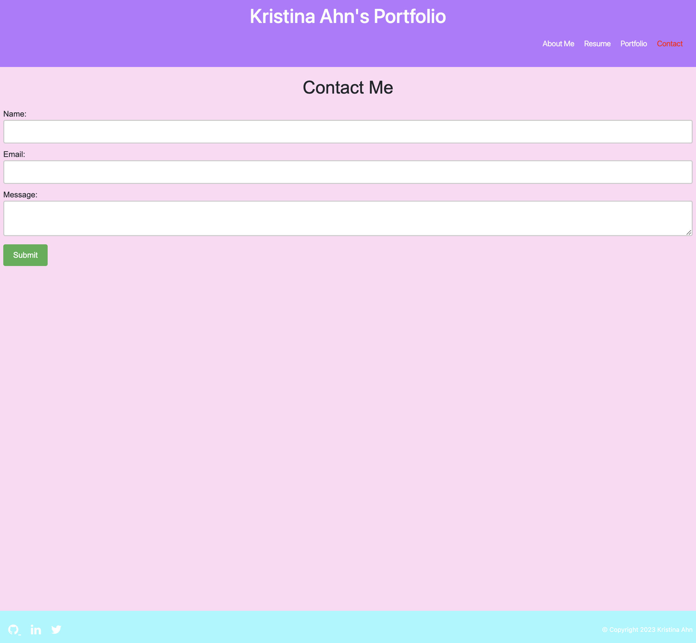

# React-Portfolio

## Description

This is a portfolio created using React. It is a single page application that uses React components to render the page. The portfolio includes a header, a navbar, a footer, and a body. The body is divided into three sections: About Me, Portfolio, and Contact. The About Me section includes a picture of me and a short bio. The Portfolio section includes links to some of my projects. The Contact section includes a form that can be used to contact me. The navbar includes links to the About Me, Portfolio, and Contact sections. The footer includes links to my GitHub and LinkedIn profiles.

## Usage

To use this portfolio, click on the links in the navbar to navigate to the About Me, Portfolio, and Contact sections. Click on the links in the footer to navigate to my GitHub and LinkedIn profiles. Click on the links in the Portfolio section to navigate to my projects. Fill out the form in the Contact section to contact me.

## Installations 

N/A 

## Credits 

N/A

## License

This project is licensed under the MIT license.

## Assets

## Deployed Link 

https://kriskris9.github.io/React-Portfolio/ 